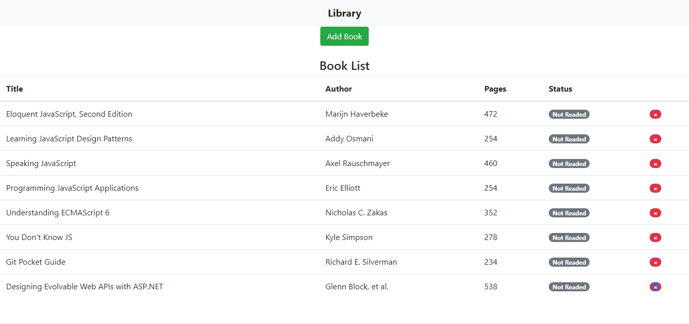

# Library

This is a Library Javascript project where user can dynamically add books and store in localstorage. User can toggle between read and not read button. user can delete and add a book.

## Built With

- Html
- CSS
- Javascript

## Project setup

- Clone the repository `git clone https://github.com/hemant-soni-vst-au4/library`
- `cd libarary`
- Open html file with live server
- click on add book button to add new book

## Live Demo

[Live Demo Link](https://hemant-soni-vst-au4.github.io/library/)

## Author

👤 **Hemant soni**

- Github: [@githubhandle](https://github.com/hemant-soni-vst-au4)
- Twitter: [@twitterhandle](https://twitter.com/abdelperez11)
- Linkedin: [linkedin](https://www.linkedin.com/in/hemant-soni-97427b193/)

👤 **Bekhzod Akhrorov**
- Github: [@githubhandle](https://github.com/Bekhzod96)

## 🤝 Contributing

Contributions, issues and feature requests are welcome! Start by:
* Forking the project
* Cloning the project to your local machine
* `cd` into the Youtube-Replica project directory
* Run `git checkout -b your-branch-name`
* Make your contributions
* Push your branch up to your forked repository
* Open a Pull Request with a detailed description to the development branch of the original project for a review

## 📝 License

This project is [MIT](https://opensource.org/licenses/MIT) licensed.